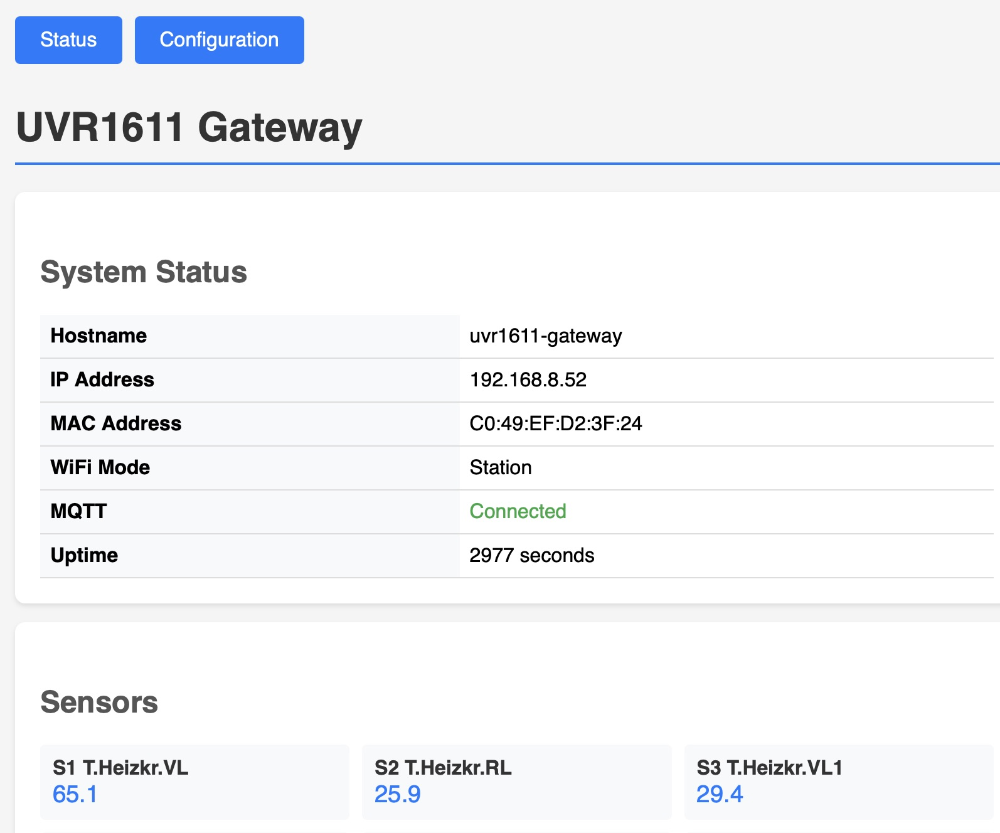
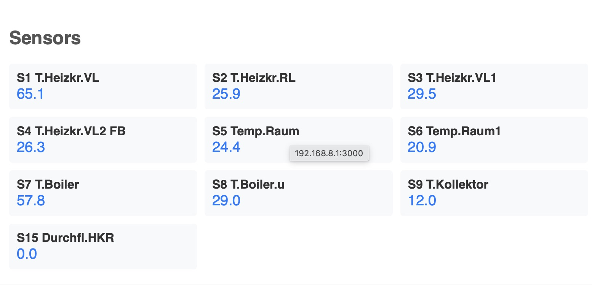
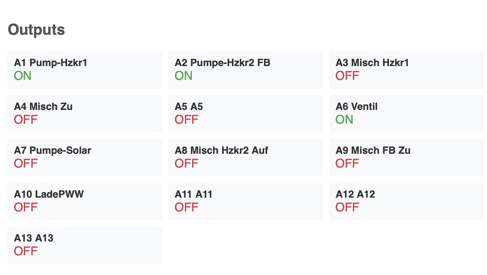
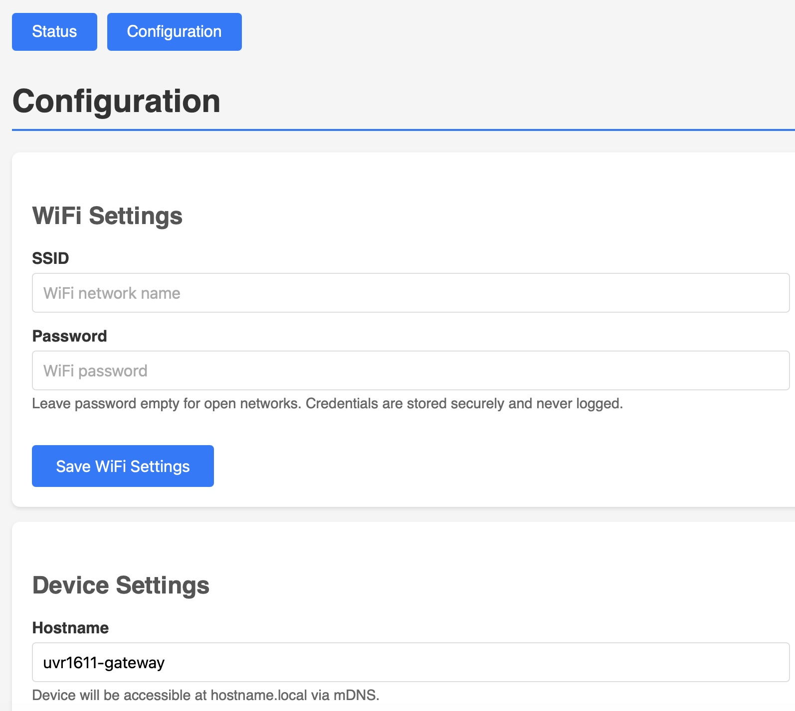
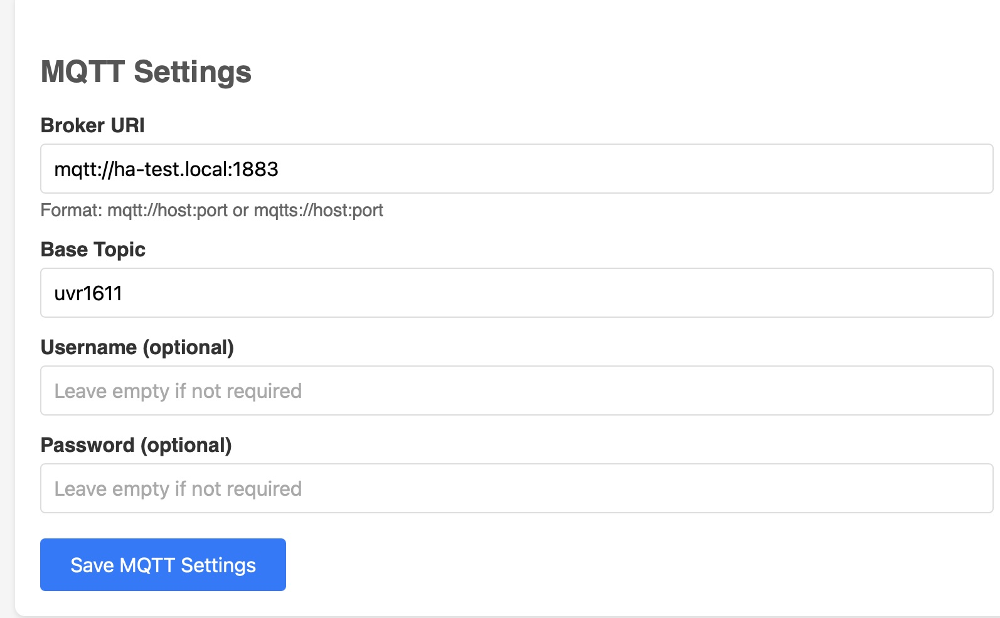
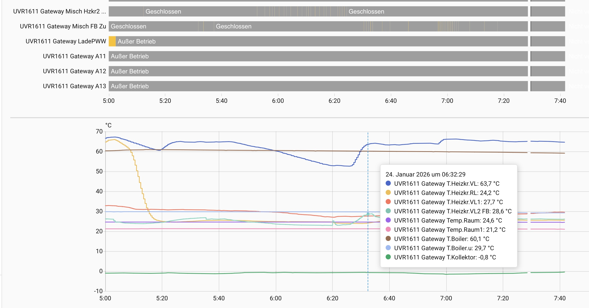

# UVR2MQTT - UVR1611 DL-Bus to MQTT Gateway

ESP32-based gateway that reads data from a Technische Alternative UVR1611 solar heating controller via DL-Bus and publishes to MQTT with Home Assistant auto-discovery.

## Hardware

- **Board**: Azdelivery D1 Mini ESP32 (ESP32-WROOM-32)
- **Connection**: DL-Bus via optocoupler to GPIO26
- **PCB Files**: KiCad schematic and PCB design files available in the `PCB/` folder, including Gerber files for manufacturing

## Features

### DL-Bus Protocol
- GPIO interrupt-based edge capture (bypasses RMT 512-symbol limitation)
- Dedicated high-priority interrupt on Core 1 (away from WiFi on Core 0)
- Manchester-like decoding with automatic polarity detection
- SYNC detection, checksum validation
- Full 64-byte frame parsing

### Sensor Data
- 16 temperature/flow/radiation sensors with configurable names
- 13 digital outputs (pumps, valves, mixers)
- 4 speed levels for variable-speed pumps
- 2 heat meters with power (kW) and energy (kWh)

### MQTT & Home Assistant
- WiFi connection with automatic reconnection
- MQTT client with Last Will and Testament (online/offline status)
- Home Assistant auto-discovery for all entities
- Configurable publish intervals
- Median filtering for sensor values
- Immediate publish on output state changes

### Web Configuration
- Built-in web UI for configuration (no rebuild required)
- WiFi STA/AP mode with automatic fallback
- Configure WiFi and MQTT settings via browser
- Edit sensor and output names (S1-S16, A1-A13)
- Live sensor and output status display
- Settings stored in NVS (persist across reboots)
- OTA firmware update via web browser

## Screenshots

### Web Interface - Status Page


### Live Sensor Data


### Output States


### WiFi Configuration


### MQTT Configuration


### Home Assistant Integration


## Configuration

### First Boot Setup (Web UI)

1. Flash the firmware to your ESP32
2. Device starts in AP mode (no credentials yet)
3. Connect to WiFi network **"UVR1611-XXXXXX"** (XXXXXX = last 6 chars of MAC address)
4. Open http://192.168.4.1 in your browser
5. Configure WiFi credentials and MQTT settings
6. Device saves settings and reboots
7. Device connects to your WiFi network
8. Access web UI via **http://uvr1611-gateway.local** or the device IP

### WiFi Modes

**STA Mode (Normal Operation)**:
- Connects to your configured WiFi network
- MQTT publishing active
- Web UI accessible at hostname.local

**AP Mode (Configuration/Fallback)**:
- Activates when no credentials or connection fails
- SSID: "UVR1611-XXXXXX"
- IP: 192.168.4.1
- Configure via web browser
- DL-Bus reading continues locally

### Sensor & Output Names

**Via Web UI (recommended):**
- Go to the `/config` page
- Edit names for sensors S1-S16 and outputs A1-A13
- Changes take effect immediately for web display
- Reboot to update MQTT topics and Home Assistant

**Via menuconfig (compile-time defaults):**
```bash
pio run -t menuconfig
```
Navigate to: "UVR1611 I/O Configuration"

### OTA Firmware Update

After initial USB flash, firmware can be updated via web browser:
1. Go to the `/config` page
2. Find "Firmware Update" section
3. Select new `.bin` firmware file
4. Click "Upload & Update Firmware"
5. Device reboots automatically with new firmware

## Building

Requires PlatformIO with ESP-IDF framework.

```bash
# Build
pio run

# Upload
pio run -t upload

# Monitor serial output
pio device monitor

# Configure sensor names
pio run -t menuconfig
```

## MQTT Topics

```
uvr1611/status                          # "online" / "offline" (LWT)
uvr1611/sensor/{sensor_name}/state      # Sensor value (median)
uvr1611/switch/{output_name}/state      # "ON" / "OFF"
uvr1611/sensor/heat_meter_1_power/state # Power in kW
uvr1611/sensor/heat_meter_1_energy/state # Energy in kWh
uvr1611/system/mac                      # MAC address
uvr1611/system/ip                       # IP address
uvr1611/system/uptime                   # Uptime in seconds
```

## Home Assistant

All entities are automatically discovered via MQTT discovery. They appear under a single device with your configured hostname:
- Temperature sensors with proper device class
- Binary sensors for outputs (pumps, valves)
- Numeric sensors for speed levels
- Power and energy sensors for heat meters
- System uptime sensor
- Diagnostic entities (IP address, MAC address, connectivity status)

Change the device name by editing the hostname in the web UI and rebooting.

## Protocol Details

### DL-Bus Timing
- Display clock: 488 Hz
- Bit duration: 2.048 ms (2048 us)
- Half-bit duration: 1.024 ms (1024 us)

### Frame Structure
- SYNC: 16 high bits
- Data: 64 bytes (start bit + 8 data bits + stop bit per byte)
- Checksum: Sum of bytes 0-62 mod 256

### Sensor Types
| Type | Description | Encoding |
|------|-------------|----------|
| 0x00 | Unused | - |
| 0x10 | Digital | Bit 7 of high byte |
| 0x20 | Temperature | 12-bit signed, /10 for °C |
| 0x30 | Flow rate | 12-bit × 4 l/h |
| 0x60 | Radiation | 12-bit W/m² |
| 0x70 | Room sensor | 9-bit signed, /10 for °C |

## Architecture

```
GPIO26 (Core 1) ─► Edge Buffer ─► Bit Extractor ─► Manchester Decoder ─► Frame Queue
                                    (Core 1)          (Core 1)              │
                                                                            ▼
WiFi/MQTT (Core 0) ◄────────────────────────────────────────────── Main Loop
```

- DL-Bus capture runs entirely on Core 1 to avoid WiFi interference
- WiFi power save disabled for consistent interrupt timing
- Dedicated GPIO interrupt (not shared ISR service) for lower latency

## Status

**All Phases Complete**:
- DL-Bus decoding: 0.2% error rate
- All sensor types parsed correctly
- MQTT publishing working
- Home Assistant auto-discovery working
- Web-based configuration UI working
- WiFi STA/AP mode with auto-fallback working
- Sensor/output name editing via web UI
- OTA firmware update via web browser

## License

MIT
